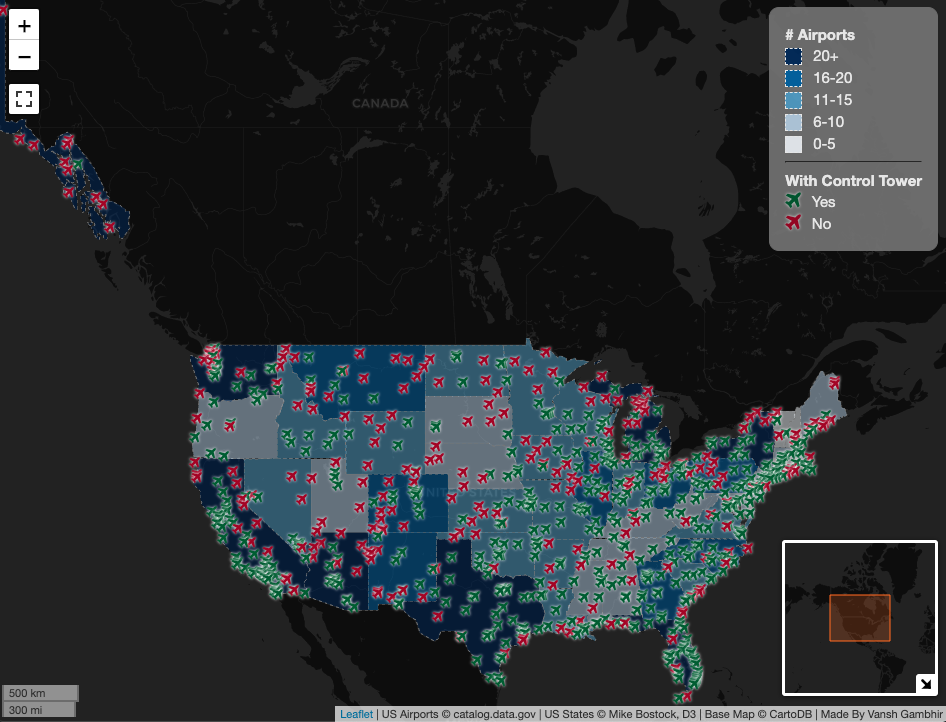

# USA Airports Web Map
This web map is created using Leaflet JS that shows all the airports in the United States. You can interact with it here: <https://kiku511.github.io/usa-airports-viz/>

## Description
Each state is colored according to the number of airports in it. You can also click on each airport to get a popup with some more details about them. If the icon for an airport is red it means it does not have an air traffic control tower. I also used Leaflet plugins for a full screen mode and minimap to make the map even more interactive.

## Reference
[1] US Airports from [catalog.data.gov](https://catalog.data.gov/dataset/usgs-small-scale-dataset-airports-of-the-united-states-201207-shapefile)

[2] US State Boundaries from [Mike Bostock](http://bost.ocks.org/mike) of [D3](http://d3js.org/)

[3] Dark base map from [CartoDB](https://github.com/CartoDB/cartodb/wiki/BaseMaps-available)

[4] Leaflet Full Screen Plugin from [Leaflet.fullscreen](https://github.com/Leaflet/Leaflet.fullscreen)

[5] Leaflet Mini Map Plugin from [Norkart](https://github.com/Norkart/Leaflet-MiniMap)
